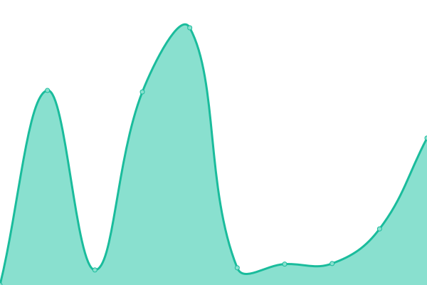
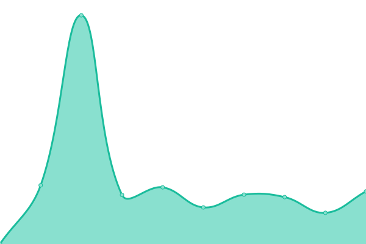
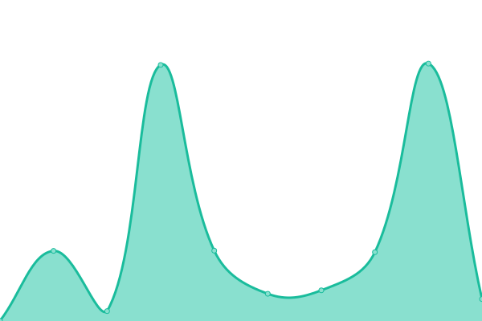
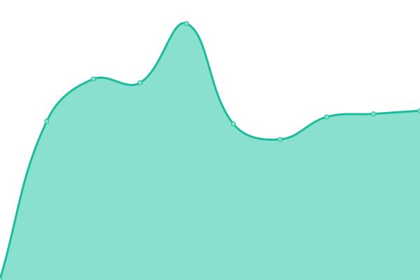
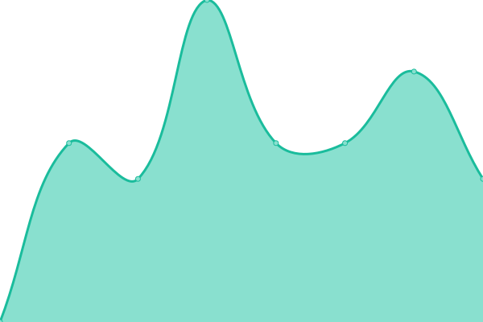
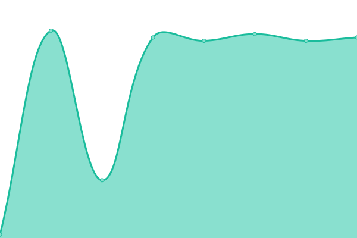

# [📈 Live Status](https://demo.upptime.js.org): <!--live status--> **🟩 All systems operational**

This repository contains the open-source uptime monitor and status page for [Upptime](https://upptime.js.org), powered by [Upptime](https://github.com/upptime/upptime).

With [Upptime](https://upptime.js.org), you can get your own unlimited and free uptime monitor and status page, powered entirely by a GitHub repository. We use [Issues](https://github.com/upptime/upptime/issues) as incident reports, [Actions](https://github.com/realewie/uptime/actions) as uptime monitors, and [Pages](https://demo.upptime.js.org) for the status page.

<!--start: status pages-->
<!-- This summary is generated by Upptime (https://github.com/upptime/upptime) -->
<!-- Do not edit this manually, your changes will be overwritten -->
<!-- prettier-ignore -->
| URL | Status | History | Response Time | Uptime |
| --- | ------ | ------- | ------------- | ------ |
|  [Google](https://www.google.com) | 🟩 Up | [google.yml](https://github.com/realewie/uptime/commits/HEAD/history/google.yml) | 

 77ms
     
 | 

<a href="https://realewie.github.io/uptime/history/google">100.00%</a>
    

|  [Wikipedia](https://en.wikipedia.org) | 🟩 Up | [wikipedia.yml](https://github.com/realewie/uptime/commits/HEAD/history/wikipedia.yml) | 

 234ms
     
 | 

<a href="https://realewie.github.io/uptime/history/wikipedia">100.00%</a>
    

|  [Hacker News](https://news.ycombinator.com) | 🟩 Up | [hacker-news.yml](https://github.com/realewie/uptime/commits/HEAD/history/hacker-news.yml) | 

 328ms
     
 | 

<a href="https://realewie.github.io/uptime/history/hacker-news">100.00%</a>
    

|  [NancyLoedy.com](https://nancyloedy.com) | 🟩 Up | [nancy-loedy-com.yml](https://github.com/realewie/uptime/commits/HEAD/history/nancy-loedy-com.yml) | 

 333ms
     
 | 

<a href="https://realewie.github.io/uptime/history/nancy-loedy-com">100.00%</a>
    

|  [Whole Minded Health](https://wholemindedhealth.com) | 🟩 Up | [whole-minded-health.yml](https://github.com/realewie/uptime/commits/HEAD/history/whole-minded-health.yml) | 

 1129ms
     
 | 

<a href="https://realewie.github.io/uptime/history/whole-minded-health">99.01%</a>
    

|  [Crossinology](https://crossinology.com) | 🟩 Up | [crossinology.yml](https://github.com/realewie/uptime/commits/HEAD/history/crossinology.yml) | 

 1209ms
     
 | 

<a href="https://realewie.github.io/uptime/history/crossinology">100.00%</a>
    

|  [McKinney BI](https://mckinney-bi.com) | 🟩 Up | [mc-kinney-bi.yml](https://github.com/realewie/uptime/commits/HEAD/history/mc-kinney-bi.yml) | 

 1565ms
     
 | 

<a href="https://realewie.github.io/uptime/history/mc-kinney-bi">100.00%</a>
    

|  [McKinney Physical Therapy](https://www.prescottpt.com) | 🟩 Up | [mc-kinney-physical-therapy.yml](https://github.com/realewie/uptime/commits/HEAD/history/mc-kinney-physical-therapy.yml) | 

 215ms
     
 | 

<a href="https://realewie.github.io/uptime/history/mc-kinney-physical-therapy">100.00%</a>
    

|  [Prescott BI](https://prescottbrainintegration.com/) | 🟩 Up | [prescott-bi.yml](https://github.com/realewie/uptime/commits/HEAD/history/prescott-bi.yml) | 

 1862ms
     
 | 

<a href="https://realewie.github.io/uptime/history/prescott-bi">100.00%</a>
    

|  [Mammoth Plumbing](https://mammothplumbingofdenver.com) | 🟩 Up | [mammoth-plumbing.yml](https://github.com/realewie/uptime/commits/HEAD/history/mammoth-plumbing.yml) | 

 331ms
     
 | 

<a href="https://realewie.github.io/uptime/history/mammoth-plumbing">100.00%</a>
    

|  [Meal Driver](https://mealdriver.net) | 🟩 Up | [meal-driver.yml](https://github.com/realewie/uptime/commits/HEAD/history/meal-driver.yml) | 

 226ms
     
 | 

<a href="https://realewie.github.io/uptime/history/meal-driver">100.00%</a>
    

|  [Meal Driver (Orders)](https://order.mealdriver.net) | 🟩 Up | [meal-driver-orders.yml](https://github.com/realewie/uptime/commits/HEAD/history/meal-driver-orders.yml) | 

 600ms
     
 | 

<a href="https://realewie.github.io/uptime/history/meal-driver-orders">100.00%</a>
    

|  [Meal Driver (Fleet)](https://fleet.mealdriver.net) | 🟩 Up | [meal-driver-fleet.yml](https://github.com/realewie/uptime/commits/HEAD/history/meal-driver-fleet.yml) | 

 406ms
     
 | 

<a href="https://realewie.github.io/uptime/history/meal-driver-fleet">100.00%</a>
    

|  [24-7 Burger](https://24-7burger.com) | 🟩 Up | [24-7-burger.yml](https://github.com/realewie/uptime/commits/HEAD/history/24-7-burger.yml) | 

 254ms
     
 | 

<a href="https://realewie.github.io/uptime/history/24-7-burger">100.00%</a>
    

|  [Google DNS 1](8.8.4.4) | 🟩 Up | [google-dns-1.yml](https://github.com/realewie/uptime/commits/HEAD/history/google-dns-1.yml) | 

 4ms
     
 | 

<a href="https://realewie.github.io/uptime/history/google-dns-1">100.00%</a>
    

|  [GoDaddy Server](50.62.146.67) | 🟩 Up | [go-daddy-server.yml](https://github.com/realewie/uptime/commits/HEAD/history/go-daddy-server.yml) | 

 57ms
     
 | 

<a href="https://realewie.github.io/uptime/history/go-daddy-server">100.00%</a>
    

|  [ShockHost Server](216.120.200.106) | 🟩 Up | [shock-host-server.yml](https://github.com/realewie/uptime/commits/HEAD/history/shock-host-server.yml) | 

 36ms
     
 | 

<a href="https://realewie.github.io/uptime/history/shock-host-server">100.00%</a>
    

|  [BlueHost Server](162.241.30.65) | 🟩 Up | [blue-host-server.yml](https://github.com/realewie/uptime/commits/HEAD/history/blue-host-server.yml) | 

 54ms
     
 | 

<a href="https://realewie.github.io/uptime/history/blue-host-server">100.00%</a>
    

<!--end: status pages-->

[**Visit our status website →**](https://demo.upptime.js.org)

## 📄 License

- Powered by: [Upptime](https://github.com/upptime/upptime)
- Code: [MIT](./LICENSE) © [Anand Chowdhary](https://anandchowdhary.com), supported by [Pabio](https://pabio.com)
- Data in the `./history` directory: [Open Database License](https://opendatacommons.org/licenses/odbl/1-0/)
