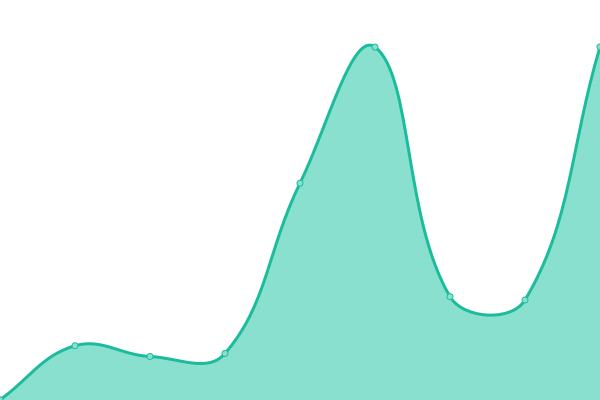

# [📈 Live Status](https://demo.upptime.js.org): <!--live status--> **🟩 All systems operational**

This repository contains the open-source uptime monitor and status page for [Upptime](https://upptime.js.org), powered by [Upptime](https://github.com/upptime/upptime).

With [Upptime](https://upptime.js.org), you can get your own unlimited and free uptime monitor and status page, powered entirely by a GitHub repository. We use [Issues](https://github.com/upptime/upptime/issues) as incident reports, [Actions](https://github.com/realewie/uptime/actions) as uptime monitors, and [Pages](https://demo.upptime.js.org) for the status page.

<!--start: status pages-->
<!-- This summary is generated by Upptime (https://github.com/upptime/upptime) -->
<!-- Do not edit this manually, your changes will be overwritten -->
<!-- prettier-ignore -->
| URL | Status | History | Response Time | Uptime |
| --- | ------ | ------- | ------------- | ------ |
|  [Google](https://www.google.com) | 🟩 Up | [google.yml](https://github.com/realewie/uptime/commits/HEAD/history/google.yml) | 

 157ms
     
 | 

<a href="https://realewie.github.io/uptime/history/google">100.00%</a>
    

|  [Wikipedia](https://en.wikipedia.org) | 🟩 Up | [wikipedia.yml](https://github.com/realewie/uptime/commits/HEAD/history/wikipedia.yml) | 

 272ms
     
 | 

<a href="https://realewie.github.io/uptime/history/wikipedia">100.00%</a>
    

|  [Hacker News](https://news.ycombinator.com) | 🟩 Up | [hacker-news.yml](https://github.com/realewie/uptime/commits/HEAD/history/hacker-news.yml) | 

 275ms
     
 | 

<a href="https://realewie.github.io/uptime/history/hacker-news">100.00%</a>
    

|  [NancyLoedy.com](https://nancyloedy.com) | 🟩 Up | [nancy-loedy-com.yml](https://github.com/realewie/uptime/commits/HEAD/history/nancy-loedy-com.yml) | 

 327ms
     
 | 

<a href="https://realewie.github.io/uptime/history/nancy-loedy-com">99.63%</a>
    

|  [Whole Minded Health](https://wholemindedhealth.com) | 🟩 Up | [whole-minded-health.yml](https://github.com/realewie/uptime/commits/HEAD/history/whole-minded-health.yml) | 

 356ms
     
 | 

<a href="https://realewie.github.io/uptime/history/whole-minded-health">100.00%</a>
    

|  [Loedy Systems](https://loedysystems.com) | 🟩 Up | [loedy-systems.yml](https://github.com/realewie/uptime/commits/HEAD/history/loedy-systems.yml) | 

 1044ms
     
 | 

<a href="https://realewie.github.io/uptime/history/loedy-systems">100.00%</a>
    

|  [Crossinology](https://crossinology.com) | 🟩 Up | [crossinology.yml](https://github.com/realewie/uptime/commits/HEAD/history/crossinology.yml) | 

 909ms
     
 | 

<a href="https://realewie.github.io/uptime/history/crossinology">100.00%</a>
    

|  [Mammoth Plumbing](https://mammothplumbingofdenver.com) | 🟩 Up | [mammoth-plumbing.yml](https://github.com/realewie/uptime/commits/HEAD/history/mammoth-plumbing.yml) | 

 664ms
     
 | 

<a href="https://realewie.github.io/uptime/history/mammoth-plumbing">100.00%</a>
    

|  [Google DNS 1](8.8.4.4) | 🟩 Up | [google-dns-1.yml](https://github.com/realewie/uptime/commits/HEAD/history/google-dns-1.yml) | 

 3ms
     
 | 

<a href="https://realewie.github.io/uptime/history/google-dns-1">100.00%</a>
    

|  [GoDaddy Server](50.62.146.67) | 🟩 Up | [go-daddy-server.yml](https://github.com/realewie/uptime/commits/HEAD/history/go-daddy-server.yml) | 

 48ms
     
 | 

<a href="https://realewie.github.io/uptime/history/go-daddy-server">100.00%</a>
    

|  [ShockHost Server](216.120.200.106) | 🟩 Up | [shock-host-server.yml](https://github.com/realewie/uptime/commits/HEAD/history/shock-host-server.yml) | 

 31ms
     
 | 

<a href="https://realewie.github.io/uptime/history/shock-host-server">100.00%</a>
    

|  [BlueHost Server](162.241.30.65) | 🟩 Up | [blue-host-server.yml](https://github.com/realewie/uptime/commits/HEAD/history/blue-host-server.yml) | 

 41ms
     
 | 

<a href="https://realewie.github.io/uptime/history/blue-host-server">100.00%</a>
    

<!--end: status pages-->

[**Visit our status website →**](https://demo.upptime.js.org)

## 📄 License

- Powered by: [Upptime](https://github.com/upptime/upptime)
- Code: [MIT](./LICENSE) © [Anand Chowdhary](https://anandchowdhary.com), supported by [Pabio](https://pabio.com)
- Data in the `./history` directory: [Open Database License](https://opendatacommons.org/licenses/odbl/1-0/)
